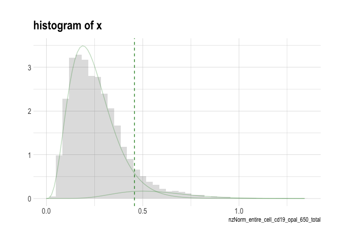
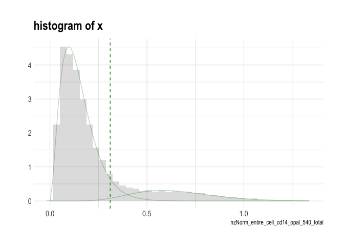
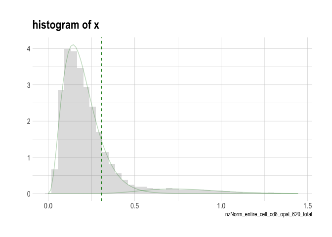
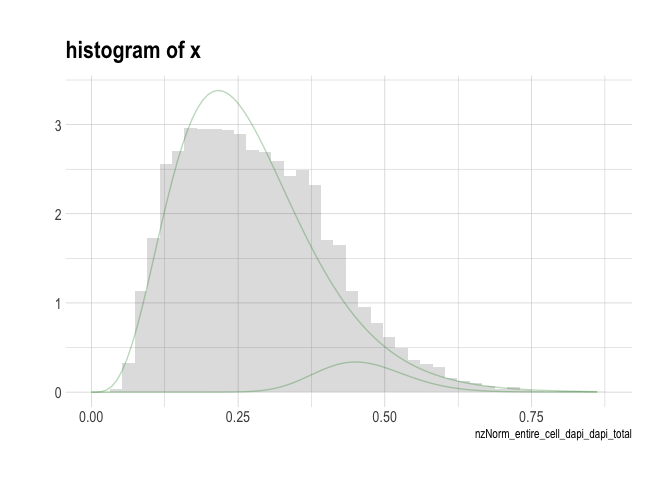
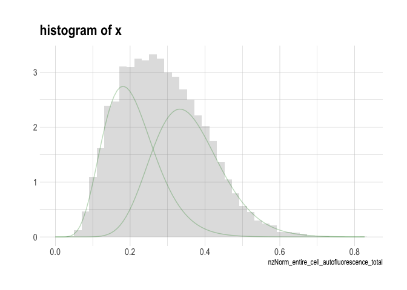
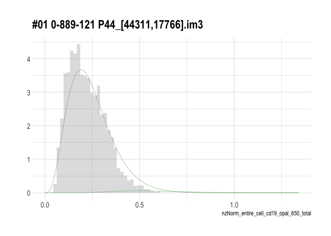

Guide for using Gluster in semi-automated cell gating
================
Ruby Xiong and Simon Vandekar
2023-03-18

# gluster

Gamma Mixture Models for Multiplexed Immunofluorescence Imaging Data

Install Package

``` r
if( !require(devtools) ) install.packages("devtools")
```

    ## Loading required package: devtools

    ## Loading required package: usethis

``` r
devtools::install_github( "statimagcoll/gluster" )
```

    ## Skipping install of 'gluster' from a github remote, the SHA1 (dddd572e) has not changed since last install.
    ##   Use `force = TRUE` to force installation

## Loading mIF data from `VectraPolarisData`

Install instructions can be found at
<https://github.com/julia-wrobel/VectraPolarisData>. After installation,
run the following:

``` r
library(VectraPolarisData)
spe_lung <- HumanLungCancerV3()
# get the cell level imaging data with spatial coordinates
cell = cbind(as.data.frame(colData(spe_lung)), as.data.frame(spatialCoords(spe_lung)) )
```

## Prepare the data for fitting gamma mixture model

Before fitting the model, the expression levels are normalized to reduce
batch effect and variation among slides. Quantile boundaries and fixed
value boundaries are picked based on prior knowledge.

``` r
library(gluster)
#devtools::install_github('statimagcoll/gluster')
allMarkers = grep('^entire_cell_.*total$', names(cell), value=TRUE)
# normalize the data 
nzNormedMarkers = paste0('nzNorm_',allMarkers)
cell = do.call(rbind, lapply(split(cell, cell$slide_id), function(df){df[,nzNormedMarkers] = log10(1+sweep(df[,allMarkers], 2, colMeans(replace(df[,allMarkers], df[,allMarkers]==0, NA), na.rm = TRUE ), FUN = '/' ) ); df }) )
# split the data frame
cells = split(cell, cell$slide_id)
# set up boundary for all markers
quantileBoundaries = list(matrix(c(0,.8, .9, 1), byrow = TRUE, nrow=2),
                          matrix(c(0,.7, .8, 1), byrow = TRUE, nrow=2),
                          matrix(c(0,.6, .8, 1), byrow = TRUE, nrow=2),
                          matrix(c(0,.6, .8, 1), byrow = TRUE, nrow=2),
                          matrix(c(0,.7, .8, 1), byrow = TRUE, nrow=2),
                          NULL,
                          NULL,
                          NULL)
boundaries = list(matrix(c(0,.3, .5, 1), byrow = TRUE, nrow=2),
                  NULL,
                  NULL,
                  NULL,
                  matrix(c(0,.3, .45, Inf), byrow = TRUE, nrow=2),
                  matrix(c(0,.3, .5, Inf), byrow = TRUE, nrow=2),
                  matrix(c(0,.4, .45, Inf), byrow = TRUE, nrow=2),
                  NULL)
names(quantileBoundaries) = names(boundaries) = nzNormedMarkers
```

## Running gluster on a single slide

Here the fitting is run both with and without constraints. Fitting run
without constraints are susceptible to statistically optimal results
(local maximum) that are not reasonable biologically.

``` r
unconstrGMMfit = gluster(cells[[1]][,nzNormedMarkers])
constrGMMfit = gluster(cells[[1]][,nzNormedMarkers], boundaryMarkers = boundaries,
                 qboundaryMarkers=quantileBoundaries)
```

### Quality checking model fit

``` r
# check convergence
convCheck(constrGMMfit)
# visualize constrained fits with quantile drawn on histogram
sapply(nzNormedMarkers, function(x) plot(constrGMMfit, marker = x, boundary = quantile(constrGMMfit$expressionX[,x], probs=quantileBoundaries[[x]][2,1], title=x) ))
```

<!-- --><!-- --><!-- --><!-- --><!-- --><!-- --><!-- --><!-- -->

``` r
# comparing constrained and unconstrained fits
trash = sapply(nzNormedMarkers, function(x) hist_sr_constrast(constrGMMfit, unconstrGMMfit, marker=x, title=x) )
```

<!-- --><!-- --><!-- --><!-- --><!-- --><!-- --><!-- --><!-- -->

## Running with sub-batches

Sub-batches can be used if there are multiple regions per slide to
assess the fit within each region. The model is fit at the slide level
and then model fit is assessed by batch.

``` r
# fitting on the same slide and getting model fit results by batch
batchConstrGMMfit = gluster(cells[[1]][,nzNormedMarkers], boundaryMarkers = boundaries,
                 qboundaryMarkers=quantileBoundaries, subBatch = cells[[1]]$sample_id)
# visualize by subBatch for the first markers
trash = sapply(unique(cells[[1]]$sample_id), function(x) plot(batchConstrGMMfit, subBatch = x, title=x) )
```

<!-- --><!-- --><!-- --><!-- --><!-- -->

## Running gluster on multiple slides

We can use mclapply from the parallel package to run gluster on multiple
slides. The example line below runs on a subset of 3 slides from the
`cell` data frame.

Alternatively, use groupGluster:

``` r
# subset of cell, first 3 slides
slide3 <- names(cells)[1:3]
cells3 <- cell[cell$slide_id %in% slide3,]
# fit cfGMM with groupGluster
constrCfGMMbunch <- groupGluster(cells3[,nzNormedMarkers], slide = cells3$slide_id,
                                 boundaryMarkers = boundaries,qboundaryMarkers=quantileBoundaries, n.cores = 5)
```

### Quality check on model fitting

Check for convergence:

``` r
convCheck(constrCfGMMbunch)
```

    ## [1] "All converged."

Before plotting and looking over the (# slides $\times$ \# markers)
histograms, it might be easier to identify the problematic ones through
diagnostic plot first:

### Plotting all histograms
